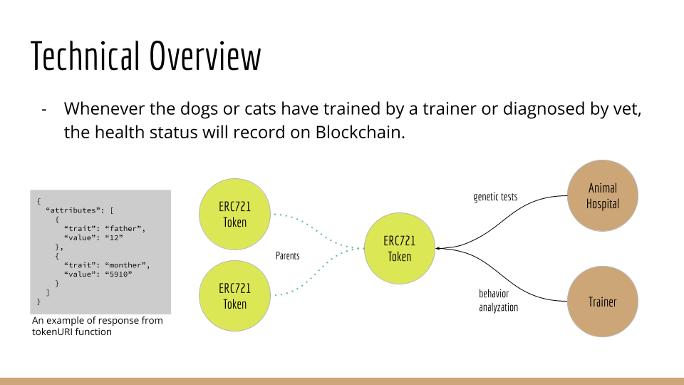

# Introduction

*This is a demo code for the final project of the course [Solving Problems with Blockchain](https://www.coursera.org/certificates/blockchain-duke) in Coursera.*

In our group, we use the [ERC721](https://eips.ethereum.org/EIPS/eip-721) token to represent the ownership of pets. You can see the example below:


We can link the relationship between the physical animal and NFT by encoding the contract address and token id to the microchip, which will be implanted into the animals.

The breeder can mint an NFT with the parent information, and the animal shelters can mint an NFT with the GPS information by using the smart contract implemented in this repository. Besides, vets and animal trainers can write the latest diagnosis into it.



A pet's health history will keep in Blockchain. We can retrieve it from the event logs, which are included in the transaction's receipt because an event `StatusChanged` will be emitted from our smart contract after the status change.


Here is an example that is retrieved from the [test](./test/FurryTrack.js:L134):

```javascript
{
  transactionIndex: 0,
  blockNumber: 549,
  transactionHash: '0x8f380a5a904b87dbebbe6de023b30da7e9fd54912974bcceab9b141b705b2069',
  address: '0xA51c1fc2f0D1a1b8494Ed1FE312d7C3a78Ed91C0',
  topics: [
    '0x2eb37796e0df5f41d73a3a3ef84a969cbae3e3efdf28ec67c0343887dc1f10b7',
    '0x0000000000000000000000000000000000000000000000000000000000000000'
  ],
  data: '0x000000000000000000000000000000000000000000000000000000000000002000000000000000000000000000000000000000000000000000000000000000086e6f742077656c6c000000000000000000000000000000000000000000000000',
  logIndex: 0,
  blockHash: '0x58d51c9804d444a7d5d2451f3e2770c7a6fe2cca829544a63455985c68932f3d',
  args: [
    BigNumber { value: "0" },
    'not well',
    tokenId: BigNumber { value: "0" },
    healthStatus: 'not well'
  ],
  decode: [Function (anonymous)],
  event: 'StatusChanged',
  eventSignature: 'StatusChanged(uint256,string)',
  removeListener: [Function (anonymous)],
  getBlock: [Function (anonymous)],
  getTransaction: [Function (anonymous)],
  getTransactionReceipt: [Function (anonymous)]
}
```

Because this is a demo code, the `healthStatus` in the example above is short. However, in an actual scenario, the health status should be a professional diagnosis from the vet.

We also design a process to avoid the possibility of manipulating data by owners:


The third step is granting permission to vet by the pet owner. In this step, the pet owner will call the function `grantWritePermission` in the smart contract, which will grant permission to the vet and let the vet can write temporarily. This function can only call by the token owner and grants permission to vet within 128 block numbers. After 128 blocks, the permission will be revoked automatically.

A complete system has three applications for pet owners, vets, and breeders (or animal shelters). All three applications will access the smart contract implemented in this repository. In vets' applications, they ca n sign a message and send it directly to the pet owners by Bluetooth or AirDrop. Then pet owners can call the function `grantWritePermission` in a smart contract to grant permission for vets. This mechanism can restrict the permission for both pet owners and vets to make sure the data are good for reference. In this repository, we only implement the smart contract for FurryTrack to demonstrate. The implementation for UI is not included in this repository.

We can track pets' ownership and genetic sources by using FurryTrack. One obvious benefit is that pet owners can see the same source diagnosed with genetic problems and take action in advance.


There are other benefits for the adopters, animal shelters, and the government.

- Adopters can choose responsible breeders and animal shelters by seeing the records in FurryTrack.
- Animal shelters can also choose experienced animal owners by visiting the resources in FurryTrack.
- The government can see the animals' health status from specific breeders or in animal shelters.

# Example

You can see more examples written with [ether.js](https://docs.ethers.io/v5/getting-started/) in the [test cases](./test/FurryTrack.js).

To run the tests by yourself, you can use the command below:

```shell
yarn hardhat test
```

Then, you can see the tests result:

```shell
yarn hardhat test
yarn run v1.22.19

  FurryTrack contract
    Deployment
      ✔ Should has the correct name and symbol
    safeMint()
      mint a new token in FurryTrack by contract owner (breeders or animal shelters)
        ✔ can initialize the metadata for this token
    grantWritePermission()
      grant write permission to the dog owner
        ✔ can not grant permission to dog owner
      grant write permission to the vet by dog owner
        ✔ the vet's wallet can write health status
        ✔ the write permission will be revoked after 128 blocks
    updateHealthStatus()
      with vet address
        ✔ update health status with the result of the diagnosis


  6 passing (1s)

✨  Done in 1.89s.
```

If you can't run the test command successfully, please follow the instruction below:

1. Install [node.js](https://nodejs.org/en/download/) with a version greater than `v18.12`.
2. Install [yarn](https://classic.yarnpkg.com/lang/en/docs/install/#mac-stable) with a version greater than `v1.22`.
3. Call the command within the directory in which you clone this repository:

```shell
yarn install
```

# Contract the Team

| GitHub    | Email               | Wallet Address or ENS        |
|-----------|---------------------|------------|
| [CaraWang](https://github.com/CaraWang)  | cara4bear@gmail.com |carawang.eth|
| [smilewilson1999](https://github.com/smilewilson1999) | smilewilson1999@gmail.com |      |
|                 | dar7an@outlook.com        |      |
|        |                           | 0xCB582862f3664722018f0c4432e9747cEE3546b6 |

